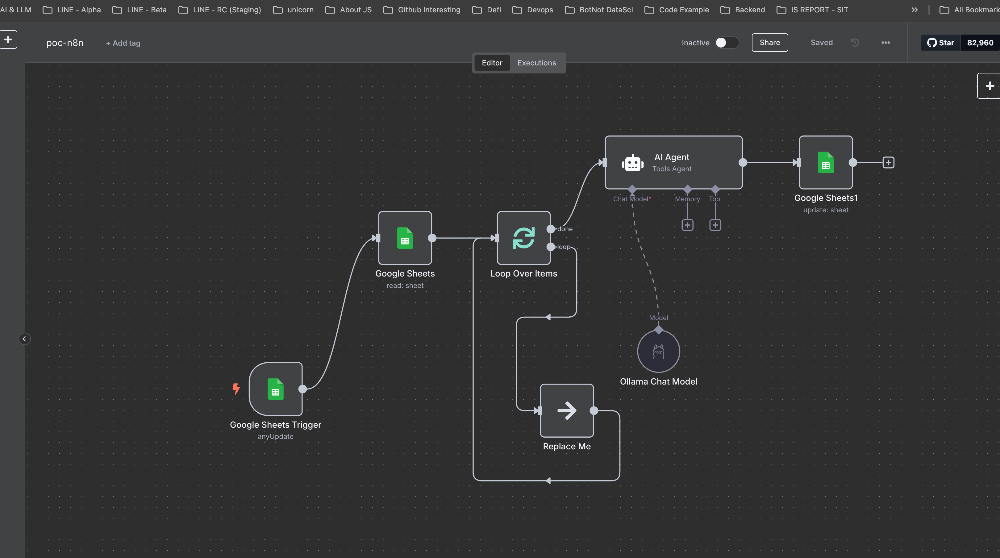

# The repo is test n8n workflow simple with docker + ollama + llama:3.2:3B model

### Prerequisite
- Docker
- Ollama and pull Llama:3.2:3B model
- Google account for enable google-sheet-api, google-drive-api


## NOTE
- backup_poc_n8n.json is workflow generate content by using ollama llama:3.2:3B model for test
- You will using gmail account for enable google-sheet-api, google-drive-api


## Docker cli run n8n
```sh
docker run -it --rm \
 --name n8n \
 -p 5678:5678 \
 n8nio/n8n

open localhost:5678
```

## Prompt test
```txt
#ROLE:
คุณรับบทเป็น ผู้เชี่ยวชาญด้าน software engineering ที่มีความรู้หลายภาษา programming โดยมีหน้าที่มุ่เน้น สร้างเนื้อหาเป็นมิตรต่อทั้งผู้อ่าน และกระตุ้นให้ผู้เข้าชมมีส่วนร่วมผ่านเนื้อหาที่อ่านง่ายและใช้ภาษาที่เข้าถึงได้ง่าย


#INSTRUCTION:
บทความต้อง:
 - หัวเรื่อง น่าสนใจ
 - ภาษาที่อ่านง่าย เป็นกันเอง และกระตุ้นความสนใจ
 - มีความยามไม่ต่ำกว่า 500 คำ

#INPUT:
กลุ่มเป้าหมาย: คนทำงานด้าน software engineer หรือ นักศึกษาจบใหม่ด้าน IT

คำสำคัญหลัก: {{ $json.content }}
วัตถุประสงค์: {{ $json.target }}
```


## Screenshot
